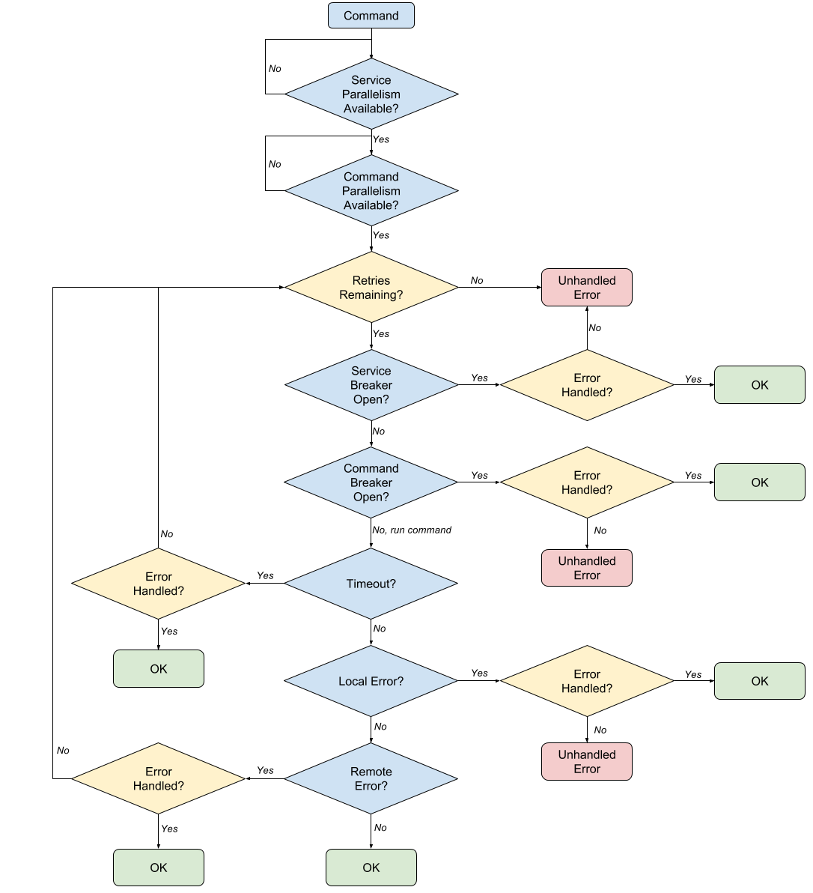

HYSTRix IMProved
===================
[![][license img]][license]
[![][travis img]][travis]

Hystrimp is a Go implementation of [Hystrix](https://github.com/Netflix/Hystrix), an innovative project from Netflix.

# What Problem Does It Solve?
Hystrimp/Hystrix provide robustness and resilience in systems with external dependencies, particularly distributed systems (see [this excellent introduction](https://github.com/Netflix/Hystrix/wiki#what-problem-does-hystrix-solve)). Because the reality of distributed systems is complex, one should *never* interact with a remote API as if it were composed of local functions. Instead, one should consider important questions such as:

* *How long am I willing to wait for the remote system's response?*
   * *What should I do if I time out before receiving a response?*
* *What do I do if the remote system responds with an error?*
* *If a request times out or returns with an error, should I retry it?*
   * *How many times should I retry the request?*
   * *How long should I wait before retrying?*
* *Should I bound the number of parallel requests I make?*
* *If the remote system is overloaded with requests, is my system part of the problem?*
   * *How long should my system back off to allow the dependency to recover?* 

Hystrimp provides a Go implementation of these ideas:



It improves upon [hystrix-go](https://github.com/afex/hystrix-go) (similar project) in the following ways:

* Support for automatic retry of command with backoff upon remote errors or timeouts.
* Remote commands are grouped into logical services
   * Support for concurrency limits on the service as a whole
   * Support for circuit breakers on a service as a whole
* Better ergonomics/interface
* Simpler implementation

# Installing
1. Install [Go](https://golang.org/doc/install)
2. Install Godep (```go get github.com/tools/godep```)
2. Run ```godep get github.com/Workiva/go-hystrimp/...```

# Updating
When new code is available on master, you can update with ```go get -u github.com/Workiva/go-hystrimp/...```

# Testing
To run unit tests, do
```
cd $GOPATH/src/github.com/Workiva/go-hystrimp
godep go test ./...
```
# Running the Example
```
godep go build -o hystrimp-example -tags example ./example/main
./hystrimp-example
```

# Contributing
To contribute, do the following:

1. Create a feature branch from master
2. Implement your contributions
3. Ensure unit test coverage
4. Ensure that you've complied with [these guidelines](https://github.com/golang/go/wiki/CodeReviewComments)
5. [gofmt](https://golang.org/cmd/gofmt/) your code
6. Commit with good commit messages
7. Create PR back to master

# Reporting Bugs and Feature Requests
Bug reports and ideas for improvement are welcome! Please use GitHub's issue tracker.

# Maintainers
Tom Deering <[tom.deering@workiva.com](mailto:tom.deering@workiva.com)>

[license]:LICENSE
[license img]:https://img.shields.io/badge/License-Apache%202-blue.svg
[travis]:https://travis-ci.org/Workiva/go-hystrimp
[travis img]:https://travis-ci.org/Workiva/go-hystrimp.svg?branch=master
