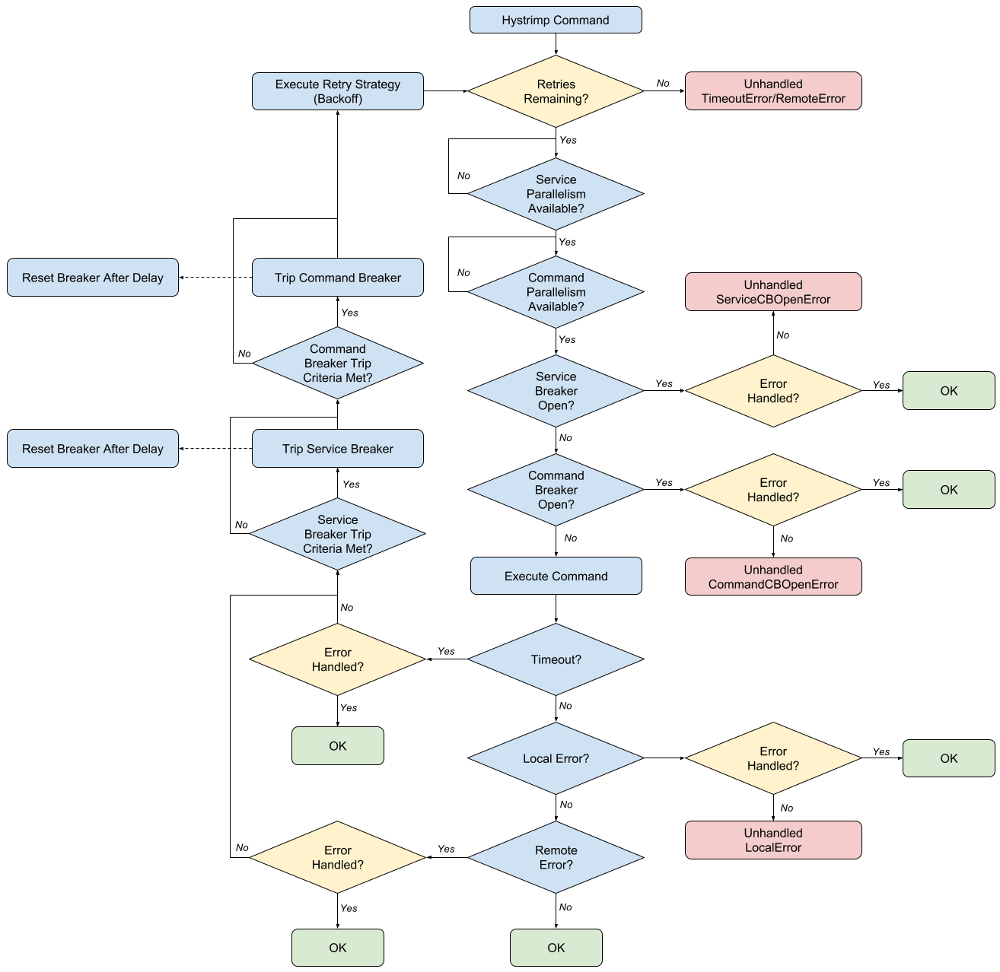

HYSTRIx iMProved
===================
[Hystrix](https://github.com/Netflix/Hystrix) is an innovative project from Netflix that aims to make interactions with external dependencies robust. It forces one to answer important questions such as:

*What do I do if I time out before hearing from the remote system?*

*What do I do if the remote system returns an error?*

*How much load should I reasonably place on the remote system?*

*If I cannot use the remote system, should I retry my request? How long should I wait before retrying?* 

Hystrimp provides a Go implementation of these ideas:



It improves upon [hystrix-go](https://github.com/afex/hystrix-go) (similar project) in the following ways:

* Support for automatic retry of command with backoff upon remote errors or timeouts.
* Remote commands are grouped into logical services
   * Support for concurrency limits on the service as a whole
   * Support for circuit breakers on a service as a whole
* Better ergonomics/interface
* Simpler implementation

# Installing
1. Install [Go](https://golang.org/doc/install)
2. Install Godep (```go get github.com/tools/godep```)
2. Run ```godep get github.com/Workiva/go-hystrimp/...```

# Updating
When new code is available on master, you can update with ```go get -u github.com/Workiva/go-hystrimp/...```

# Testing
To run unit tests, do
```
cd $GOPATH/src/github.com/Workiva/go-hystrimp
godep go test ./...
```

# Contributing
To contribute, do the following:

1. Create a feature branch from master
2. Implement your contributions
3. Ensure unit test coverage
4. Ensure that you've complied with [these guidelines](https://github.com/golang/go/wiki/CodeReviewComments)
5. [gofmt](https://golang.org/cmd/gofmt/) your code
6. Commit with good commit messages
7. Create PR back to master

# Reporting Bugs and Feature Requests
Bug reports and ideas for improvement are welcome! Please use GitHub's issue tracker.
